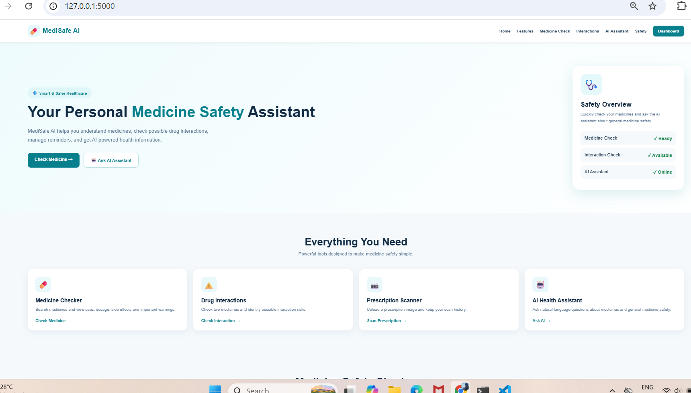
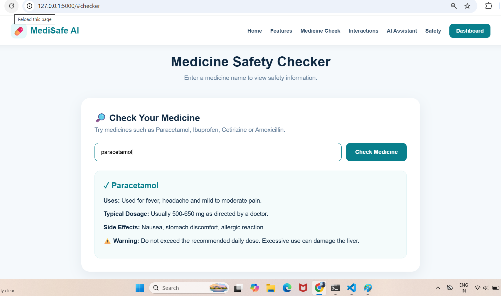
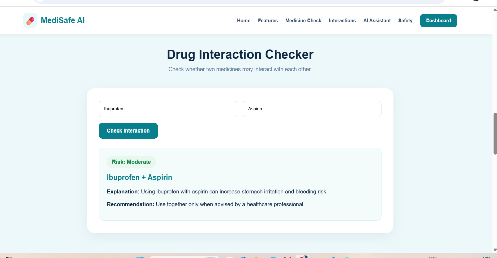
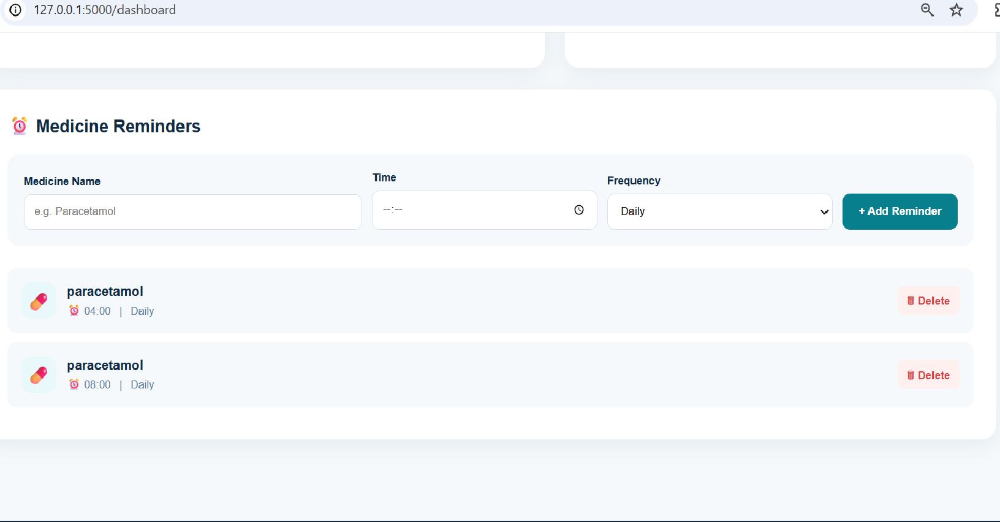

# 💊 MediSafe AI

## Smart Medicine Safety Assistant

MediSafe AI is a web-based medicine safety assistant that helps users check medicines, identify potential drug interactions, manage medicine reminders, and scan prescriptions.
## 📸 Project Preview

 

### 🚀 Features

- 💊 Medicine Checker
- ⚠️ Drug Interaction Checker
- ⏰ Medicine Reminders
- 📊 Health Dashboard
- 📜 Prescription Scanner
- 🤖 AI Health Assistant
- 🗂️ Search & Scan History

### 🛠️ Tech Stack

- Python
- Flask
- SQLite
- HTML
- CSS
- JavaScript
- OpenAI API

### ⚠️ Disclaimer

This project is for educational and demonstration purposes only. It is not a replacement for professional medical advice.

### 👩‍💻 Author

**Vaishnavi Verma**
